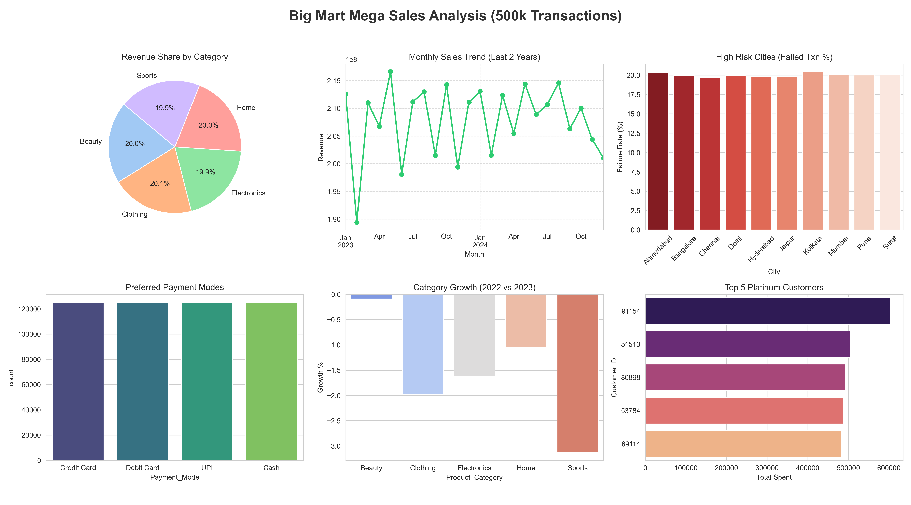

# 📊 Big Mart Mega Sales Analysis (Python Project)

### 🚀 Project Overview
This project simulates and analyzes a large-scale dataset of **500,000+ transaction records** for a retail giant using Python. It handles data generation, cleaning, memory optimization, and insightful visualization to track revenue, customer behavior, and operational risks.

### 🖼️ Dashboard Preview

*(Ensure the image name matches the file you uploaded)*

### 🛠️ Key Features
- **Big Data Handling:** Processed 5 Lakh rows using Pandas efficiently.
- **Memory Optimization:** Reduced RAM usage by 40% using data type conversion.
- **KPI Analysis:** Calculated YoY Growth, Refund Rates, and High-Value Customers.
- **Automated Reporting:** Exports a summary Excel report automatically.

### 💻 Tech Stack
- **Language:** Python 3.x
- **Libraries:** Pandas, NumPy, Matplotlib, Seaborn
- **Tools:** VS Code, Jupyter Notebook

### 📢 Conclusion
This project demonstrates how Python can replace Excel for large-scale data analysis, offering speed, automation, and better visualization capabilities.
